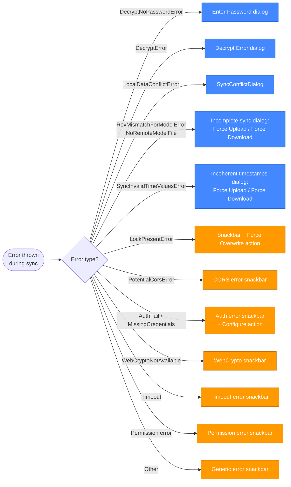

# File-Based Sync Flow — Mermaid Chart

Visual overview of the sync decision tree for file-based providers (Dropbox, WebDAV, LocalFile). For the SuperSync equivalent see [supersync-scenarios-flowchart.md](./supersync-scenarios-flowchart.md).

Both share the same op-log infrastructure (`OperationLogSyncService`, `RemoteOpsProcessingService`, conflict detection) but differ in the transport/adapter layer.

```mermaid
flowchart TD
    START([Sync Triggered]) --> DL[Download sync-data.json<br/>gap detection handled internally]

    %% ── SERVER MIGRATION (file-based specific) ──────────────────
    DL --> MIG_CHK{Server migration?<br/>gap + empty server}
    MIG_CHK -->|Yes| MIGRATION[Server migration:<br/>handleServerMigration<br/>creates SYNC_IMPORT]
    MIG_CHK -->|No| DECRYPT

    %% ── DECRYPTION (shared with SuperSync) ────────────────────────
    DECRYPT{Encrypted?}
    DECRYPT -->|Yes| DECRYPT_OK{Decryption succeeds?}
    DECRYPT -->|No| SNAPSHOT_CHK
    DECRYPT_OK -->|Yes| SNAPSHOT_CHK
    DECRYPT_OK -->|No password configured| NO_PWD_DLG[Enter Password dialog:<br/>Save & Sync / Force Overwrite / Cancel]
    DECRYPT_OK -->|Wrong password| WRONG_PWD_DLG[Decrypt Error dialog:<br/>Save & Sync / Use Local / Cancel]
    NO_PWD_DLG -->|Save & Sync| START
    NO_PWD_DLG -->|Force Overwrite| FORCE_UP[Force upload local state<br/>SYNC_IMPORT]
    WRONG_PWD_DLG -->|Save & Sync| START
    WRONG_PWD_DLG -->|Use Local| FORCE_UP

    %% ── SNAPSHOT vs INCREMENTAL BRANCH (file-based specific) ────
    SNAPSHOT_CHK{snapshotState<br/>received?<br/>seq 0 download only}
    SNAPSHOT_CHK -->|Yes| SS_OPS
    SNAPSHOT_CHK -->|No| HAS_OPS

    %% ── SNAPSHOT PATH (file-based specific) ─────────────────────
    SS_OPS{Has meaningful<br/>unsynced ops?}
    SS_OPS -->|Yes| SS_CONFLICT[SyncConflictDialog:<br/>USE_LOCAL / USE_REMOTE / CANCEL]
    SS_OPS -->|No| SS_FRESH{Fresh client?}
    SS_FRESH -->|Yes + meaningful<br/>store data| SS_CONFLICT
    SS_FRESH -->|Yes + no local data| SS_CONFIRM[Confirm dialog:<br/>Download remote?]
    SS_FRESH -->|Not fresh| HYDRATE
    SS_CONFLICT -->|Use Local| FORCE_UP
    SS_CONFLICT -->|Use Remote| FORCE_DL[Force download<br/>from seq 0]
    SS_CONFLICT -->|Cancel| CANCELLED([Sync Cancelled])
    SS_CONFIRM -->|OK| HYDRATE[Hydrate from<br/>snapshotState]
    SS_CONFIRM -->|Cancel| CANCELLED
    HYDRATE --> UPLOAD

    %% ── INCREMENTAL OPS PATH (shared logic) ────────────────────
    HAS_OPS{Remote ops found?}

    %% No remote ops
    HAS_OPS -->|No| EMPTY_SVR{Empty server<br/>+ fresh client<br/>+ has local data?}
    EMPTY_SVR -->|Yes| SILENT_MIG[Silent server migration<br/>creates SYNC_IMPORT]
    EMPTY_SVR -->|No| UPLOAD
    SILENT_MIG --> UPLOAD

    %% Has remote ops
    HAS_OPS -->|Yes| IS_FRESH{Fresh client?}
    IS_FRESH -->|No| IS_IMPORT
    IS_FRESH -->|Yes + has local data| CONFLICT_DLG[SyncConflictDialog:<br/>USE_LOCAL / USE_REMOTE / CANCEL]
    IS_FRESH -->|Yes + no local data| CONFIRM[Confirm dialog:<br/>Download remote?]
    CONFIRM -->|OK| APPLY
    CONFIRM -->|Cancel| CANCELLED
    CONFLICT_DLG -->|Use Local| FORCE_UP
    CONFLICT_DLG -->|Use Remote| FORCE_DL
    CONFLICT_DLG -->|Cancel| CANCELLED

    %% SYNC_IMPORT handling (shared logic)
    IS_IMPORT{Contains SYNC_IMPORT?}
    IS_IMPORT -->|No| CONFLICT_CHK
    IS_IMPORT -->|Yes| ENC_ONLY{Encryption-only change<br/>+ no pending ops?}
    ENC_ONLY -->|Yes| APPLY
    ENC_ONLY -->|No| IMPORT_HAS{Has pending ops<br/>or meaningful<br/>local data?}
    IMPORT_HAS -->|Yes| IMPORT_DLG[ImportConflictDialog:<br/>import reason shown,<br/>Use Server Data recommended]
    IMPORT_HAS -->|No| APPLY_IMPORT[Apply full state replacement]
    IMPORT_DLG -->|Use Server| FORCE_DL
    IMPORT_DLG -->|Use Local| FORCE_UP
    IMPORT_DLG -->|Cancel| CANCELLED

    %% Conflict detection (shared logic)
    CONFLICT_CHK{Vector clock conflict?} -->|CONCURRENT| LWW[Auto-resolve LWW<br/>later timestamp wins<br/>ties → remote wins<br/>archive ops always win]
    CONFLICT_CHK -->|No conflict| APPLY
    LWW --> APPLY[Apply ops to NgRx store]
    APPLY_IMPORT --> UPLOAD

    %% ── UPLOAD PHASE (file-based specific) ─────────────────────
    APPLY --> UPLOAD[Upload: merge state<br/>into sync-data.json]
    UPLOAD --> REV{Rev match<br/>on upload?}
    REV -->|OK| IN_SYNC([IN_SYNC ✓])
    REV -->|Mismatch| RETRY[Exponential backoff:<br/>re-download, rebuild,<br/>re-upload]
    RETRY --> RETRY_CHK{Max retries?}
    RETRY_CHK -->|Not exceeded| REV
    RETRY_CHK -->|Exceeded| ERROR

    FORCE_UP --> IN_SYNC
    FORCE_DL --> IN_SYNC
    MIGRATION --> IN_SYNC
    ERROR([ERROR])

    %% Styling
    classDef success fill:#2d6,stroke:#1a4,color:#fff
    classDef error fill:#d33,stroke:#a11,color:#fff
    classDef cancel fill:#888,stroke:#555,color:#fff
    classDef dialog fill:#48f,stroke:#26d,color:#fff
    classDef action fill:#e90,stroke:#b60,color:#fff,stroke-width:3px

    class IN_SYNC success
    class ERROR error
    class CANCELLED cancel
    class SS_CONFIRM,CONFIRM,SS_CONFLICT,CONFLICT_DLG,IMPORT_DLG,NO_PWD_DLG,WRONG_PWD_DLG dialog
    class APPLY,APPLY_IMPORT,FORCE_UP,FORCE_DL,MIGRATION,UPLOAD,SILENT_MIG,HYDRATE,RETRY action
```

## Error Handling (SyncWrapperService)

Errors thrown during sync are caught by `SyncWrapperService._sync()`. File-based providers surface additional error types not seen with SuperSync:

**Legend:**

- 🟢 Green = success states
- 🔴 Red = error states
- 🔵 Blue = user-facing dialogs
- 🟠 Orange = key actions (state changes, uploads, downloads)
- ⚫ Gray = cancelled/disabled

## Key Differences from SuperSync

| Aspect | File-Based (Dropbox, WebDAV, LocalFile) | SuperSync |
|--------|----------------------------------------|-----------|
| **Transport** | Downloads/uploads a single `sync-data.json` file | Paginated API (server-side op log) |
| **Snapshot path** | Full `snapshotState` on seq 0 download, with its own conflict-checking flow | No snapshot concept — all ops are incremental |
| **Gap detection** | Adapter detects syncVersion reset / snapshot replacement / partial trimming → re-download from seq 0 | Server handles gap detection internally |
| **Server migration** | Gap on empty server → `needsFullStateUpload` → `handleServerMigration()` | Same concept but detected via different mechanism |
| **Upload retry** | Rev matching (ETag) + exponential backoff with jitter | Server rejection codes (`CONFLICT_CONCURRENT`) |
| **Piggybacking** | Not applicable — no server to piggyback. Concurrent changes are discovered on re-download during retry. | Server returns piggybacked ops in upload response |
| **Post-sync encryption prompt** | Not applicable | Prompts user to set password or disable sync |
| **File-based error types** | `RevMismatchForModelError`, `NoRemoteModelFile`, `SyncInvalidTimeValuesError`, `LockPresentError`, `PotentialCorsError` | Not applicable |

## Notes

- The `Enter Password` and `Decrypt Error` dialogs correspond to `DecryptNoPasswordError` and `DecryptError` respectively — they are shared with SuperSync and are distinct components with different options.
- `Encryption-only change` bypass: when an incoming SYNC_IMPORT has `syncImportReason === 'PASSWORD_CHANGED'` and there are no meaningful pending ops, the dialog is skipped (data is identical, only encryption changed).
- LWW tie-breaking: on equal timestamps, remote wins (server-authoritative). `moveToArchive` operations always win regardless of timestamp.
- Gap detection triggers: (1) syncVersion reset — another client uploaded a snapshot resetting the counter; (2) snapshot replacement — `recentOps` is empty but `state` exists and `clientId` differs; (3) partial trimming — `oldestOpSyncVersion > sinceSeq` and buffer is full.
- Upload retry uses exponential backoff: `base × 2^(attempt-1) + random(0..50%)` with max retries defined by `FILE_BASED_SYNC_CONSTANTS.MAX_UPLOAD_RETRIES`.

## Key Source Files

| File | Role |
|------|------|
| `src/app/imex/sync/sync-wrapper.service.ts` | Top-level orchestration + error handling |
| `src/app/op-log/sync/operation-log-sync.service.ts` | Download/upload orchestration, fresh client checks, SYNC_IMPORT handling |
| `src/app/op-log/sync/operation-log-download.service.ts` | Download + internal gap detection |
| `src/app/op-log/sync-providers/file-based/file-based-sync-adapter.service.ts` | File adapter (rev matching, gap detection, snapshot upload) |
