# SuperSync Sync Flow — Mermaid Chart

Visual overview of the main sync decision tree. For full details see [supersync-scenarios.md](./supersync-scenarios.md).

```mermaid
flowchart TD
    START([Sync Triggered]) --> DL[Download remote ops]
    DL --> HAS_OPS{Remote ops found?}

    %% No remote ops path
    HAS_OPS -->|No| EMPTY_SVR{Empty server<br/>+ fresh client<br/>+ has local data?}
    EMPTY_SVR -->|Yes| SILENT_MIG[Silent server migration<br/>creates SYNC_IMPORT]
    EMPTY_SVR -->|No| UPLOAD
    SILENT_MIG --> UPLOAD

    %% Has remote ops path
    HAS_OPS -->|Yes| DECRYPT{Encrypted?}

    %% Decryption path (two distinct error dialogs)
    DECRYPT -->|Yes| DECRYPT_OK{Decryption succeeds?}
    DECRYPT -->|No| IS_FRESH
    DECRYPT_OK -->|Yes| IS_FRESH
    DECRYPT_OK -->|No password configured| NO_PWD_DLG[Enter Password dialog:<br/>Save & Sync / Force Overwrite / Cancel]
    DECRYPT_OK -->|Wrong password| WRONG_PWD_DLG[Decrypt Error dialog:<br/>Save & Sync / Use Local Data / Cancel]
    NO_PWD_DLG -->|Save & Sync| START
    NO_PWD_DLG -->|Force Overwrite| FORCE_UP[Force upload local state<br/>SYNC_IMPORT]
    WRONG_PWD_DLG -->|Save & Sync| START
    WRONG_PWD_DLG -->|Use Local| FORCE_UP

    %% Fresh client check (under "has remote ops" branch)
    IS_FRESH{Fresh client?}
    IS_FRESH -->|No| IS_IMPORT
    IS_FRESH -->|Yes + has local data| CONFLICT_DLG[SyncConflictDialog:<br/>USE_LOCAL / USE_REMOTE / CANCEL]
    IS_FRESH -->|Yes + no local data| CONFIRM[Confirm dialog:<br/>Download remote?]
    CONFIRM -->|OK| APPLY
    CONFIRM -->|Cancel| CANCELLED([Sync Cancelled])
    CONFLICT_DLG -->|Use Local| FORCE_UP
    CONFLICT_DLG -->|Use Remote| FORCE_DL[Force download<br/>from seq 0]
    CONFLICT_DLG -->|Cancel| CANCELLED

    %% SYNC_IMPORT handling
    IS_IMPORT{Contains SYNC_IMPORT?}
    IS_IMPORT -->|No| CONFLICT_CHK
    IS_IMPORT -->|Yes| ENC_ONLY{Encryption-only change<br/>+ no pending ops?}
    ENC_ONLY -->|Yes| APPLY
    ENC_ONLY -->|No| IMPORT_CONFLICT{Has pending ops<br/>or meaningful<br/>local data?}
    IMPORT_CONFLICT -->|Yes| IMPORT_DLG[ImportConflictDialog:<br/>import reason shown,<br/>Use Server Data recommended]
    IMPORT_CONFLICT -->|No| APPLY_IMPORT[Apply full state replacement]
    IMPORT_DLG -->|Use Server| FORCE_DL
    IMPORT_DLG -->|Use Local| FORCE_UP
    IMPORT_DLG -->|Cancel| CANCELLED

    %% Conflict detection
    CONFLICT_CHK{Vector clock conflict?} -->|CONCURRENT| LWW[Auto-resolve LWW<br/>later timestamp wins<br/>ties → remote wins<br/>archive ops always win]
    CONFLICT_CHK -->|No conflict| APPLY

    LWW --> APPLY[Apply ops to NgRx store]
    APPLY_IMPORT --> UPLOAD

    %% Upload phase
    APPLY --> UPLOAD[Upload pending local ops]
    UPLOAD --> REJECTED{Server rejects any?}

    REJECTED -->|No| PIGGYBACK[Process piggybacked ops]
    REJECTED -->|CONFLICT_CONCURRENT| REDOWNLOAD[Re-download & resolve<br/>max 3 retries per entity]
    REJECTED -->|VALIDATION_ERROR| PERM_REJECT[Op permanently rejected]
    REJECTED -->|Payload too large| ALERT[Alert dialog, sync stops]

    REDOWNLOAD --> CONFLICT_CHK
    PIGGYBACK --> ENCRYPT_CHK

    %% Post-sync encryption check
    ENCRYPT_CHK{SuperSync without<br/>encryption?}
    ENCRYPT_CHK -->|Yes| ENC_PROMPT[Encryption prompt:<br/>Set password or disable sync]
    ENCRYPT_CHK -->|No| IN_SYNC([IN_SYNC ✓])
    ENC_PROMPT -->|Password set| ENABLE_ENC[Enable encryption:<br/>delete server → upload encrypted]
    ENC_PROMPT -->|Disable SuperSync| DISABLE([Sync Disabled])
    ENABLE_ENC --> IN_SYNC

    FORCE_UP --> IN_SYNC
    FORCE_DL --> IN_SYNC
    PERM_REJECT --> ERROR([ERROR])
    ALERT --> ERROR

    %% Styling
    classDef success fill:#2d6,stroke:#1a4,color:#fff
    classDef error fill:#d33,stroke:#a11,color:#fff
    classDef cancel fill:#888,stroke:#555,color:#fff
    classDef dialog fill:#48f,stroke:#26d,color:#fff
    classDef action fill:#e90,stroke:#b60,color:#fff,stroke-width:3px

    class IN_SYNC success
    class ERROR error
    class CANCELLED,DISABLE cancel
    class CONFIRM,CONFLICT_DLG,IMPORT_DLG,NO_PWD_DLG,WRONG_PWD_DLG,ENC_PROMPT dialog
    class APPLY,APPLY_IMPORT,FORCE_UP,FORCE_DL,ENABLE_ENC,UPLOAD,SILENT_MIG action
```

**Legend:**

- 🟢 Green = success states
- 🔴 Red = error states
- 🔵 Blue = user-facing dialogs
- 🟠 Orange = key actions (state changes, uploads, downloads)
- ⚫ Gray = cancelled/disabled

**Notes:**

- The `Enter Password` and `Decrypt Error` dialogs correspond to `DecryptNoPasswordError` and `DecryptError` respectively — they are distinct components with different options.
- `Encryption-only change` bypass: when an incoming SYNC_IMPORT has `syncImportReason === 'PASSWORD_CHANGED'` and there are no meaningful pending ops, the dialog is skipped (data is identical, only encryption changed).
- LWW tie-breaking: on equal timestamps, remote wins (server-authoritative). `moveToArchive` operations always win regardless of timestamp.
- Re-download retry limit: max 3 resolution attempts per entity (`MAX_CONCURRENT_RESOLUTION_ATTEMPTS`); if exceeded, ops are permanently rejected.
